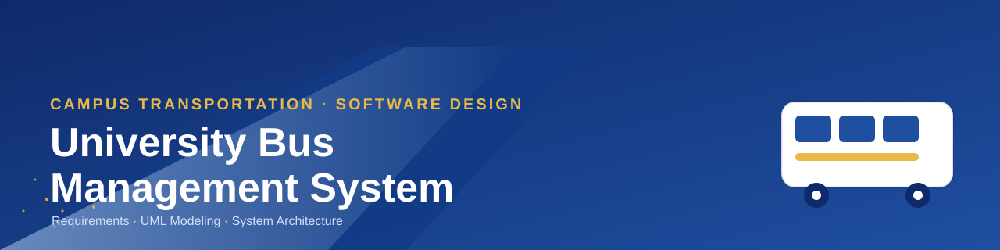
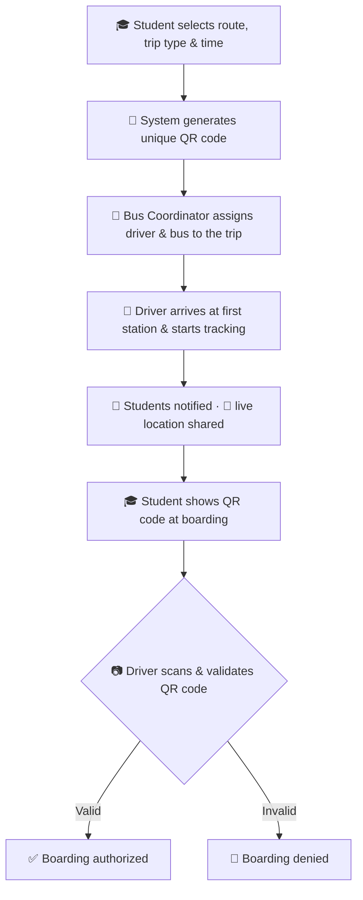

<div align="center">



# 🚌 University Bus Management System

### Smart, secure, and scalable campus transportation — from requirements to architecture.

[](LICENSE)
[](#-project-status)
[](#-non-functional-requirements)
[](#-non-functional-requirements)
[](#-uml--system-diagrams)
[](CONTRIBUTING.md)
[](#)

<sub>Once pushed to GitHub, swap in your own repo path to activate live stats:</sub>
<br>
<sub><code></code></sub>

</div>

---

## 📖 Table of Contents

- [Overview](#-overview)
- [Problem Statement](#-problem-statement)
- [Objectives](#-objectives)
- [Key Features](#-key-features)
- [System Actors](#-system-actors)
- [Functional Requirements](#-functional-requirements)
- [Non-Functional Requirements](#-non-functional-requirements)
- [System Workflow](#-system-workflow)
- [UML & System Diagrams](#-uml--system-diagrams)
- [Technologies & Standards](#-technologies--standards)
- [Repository Structure](#-repository-structure)
- [Documentation Index](#-documentation-index)
- [Future Improvements](#-future-improvements)
- [Contributing](#-contributing)
- [Team & Supervisors](#-team--supervisors)
- [License](#-license)
- [Contact](#-contact)

---

## 🔎 Overview

The **University Bus Management System** is a software design for streamlining university transportation for students and staff. It replaces manual, ad-hoc bus coordination with an automated platform covering **trip booking, QR-based boarding validation, real-time bus tracking, and administrative control** — built around four roles: **Student**, **Bus Driver**, **Bus Coordinator**, and **Administrator**.

This repository contains the complete **requirements specification, actor/use-case model, and UML system design** (sequence, class, activity, state, collaboration, and data-flow diagrams) produced for this project, restructured into a browsable, recruiter-friendly engineering repository.

> 📌 **Project status:** This repository documents the **analysis & design phase**. It does not yet contain a source-code implementation — see [Future Improvements](#-future-improvements).

## 🧩 Problem Statement

University bus transportation, when managed manually, typically suffers from:

- No visibility into **where a bus currently is**, leaving students waiting blindly.
- Manual, error-prone **seat/trip booking** with no enforced capacity control.
- No reliable way to **verify a rider's identity** before boarding, opening the door to misuse.
- Ad-hoc, spreadsheet-style **driver and bus assignment** that doesn't scale as routes grow.
- No centralized system for administrators to **control, audit, or update** transportation operations.

## 🎯 Objectives

- Provide a **reliable and convenient** transportation booking experience for students.
- Improve **efficiency, security, and user experience** across the entire trip lifecycle.
- Give bus coordinators a structured way to **assign drivers and buses** based on real demand.
- Give administrators centralized **control and oversight** of the whole system.
- Ensure every boarding is **verifiable** through unique, single-use QR codes.

## ✨ Key Features

| Feature | Description |
|---|---|
| 🗺️ **Route & Trip Booking** | Students select a route, a going/return trip type, and a time slot. |
| 🔳 **Unique QR Code Generation** | Every confirmed booking receives a unique QR code for boarding validation. |
| ❌ **Booking Cancellation** | Students can cancel a previously booked trip. |
| 📍 **Real-Time Bus Tracking** | Drivers start live tracking; students view the bus's real-time location. |
| 🔔 **First-Station Notifications** | Students are notified the moment the bus reaches its first station. |
| 📷 **QR Code Validation at Boarding** | Drivers scan and validate each student's QR code before boarding. |
| 🧑‍✈️ **Driver & Bus Assignment** | Coordinators assign the right driver and bus to each scheduled trip. |
| 🛠️ **Centralized System Administration** | Administrators control settings and update schedules/user data. |

## 👥 System Actors

| Actor | Responsibilities |
|---|---|
| 🎓 **Student** | Book/cancel trips, receive a QR code, track the bus, board using the QR code. |
| 🚌 **Bus Driver** | Start live trip tracking, scan and validate student QR codes at boarding. |
| 🧭 **Bus Coordinator** | Assign drivers and buses to scheduled trips based on demand. |
| 🛠️ **Administrator** | Control system settings, update trip schedules and user information. |

## ✅ Functional Requirements

Thirteen functional requirements, grouped into six areas. Full detail — including traceability to diagrams — lives in **[`REQUIREMENTS.md`](REQUIREMENTS.md)**.

<details>
<summary><strong>Show all 13 functional requirements</strong></summary>

| ID | Area | Requirement |
|---|---|---|
| FR-01 | Trip Management | The system allows the Bus Coordinator to assign a driver to each scheduled trip. |
| FR-02 | Trip Management | The system allows the Bus Coordinator to assign a specific bus to each scheduled trip. |
| FR-03 | System Management | The system allows the Administrator to control system settings. |
| FR-04 | System Management | The system shall allow the Administrator to update trip schedules and user information. |
| FR-05 | Booking a Trip | The system allows the Student to select a route. |
| FR-06 | Booking a Trip | The system allows the Student to select a going and return trip. |
| FR-07 | Booking a Trip | The system allows the Student to select a time slot for each trip, either going or return. |
| FR-08 | QR Code | The system should generate a unique QR code for the Student after booking a trip. |
| FR-09 | Cancellation | The system shall allow the Student to cancel a previously booked trip. |
| FR-10 | Bus Tracking | The system should allow the Bus Driver to start trip tracking when the journey begins. |
| FR-11 | Bus Tracking | The system will notify students when the bus driver reaches the first station. |
| FR-12 | Bus Tracking | The system shall allow the Student to view the real-time location of the bus. |
| FR-13 | QR Validation | The system allows the Bus Driver to scan and validate the student's QR code before boarding. |

</details>

## 🛡️ Non-Functional Requirements

Full detail in **[`REQUIREMENTS.md`](REQUIREMENTS.md)**.

| Category | Highlights |
|---|---|
| ⚡ **Performance** | UI loads in < 3s · operations respond in < 2s · supports ≥ 500 concurrent users |
| 📈 **Scalability** | Scales to more users/buses without major infra changes · easy to add routes/stations |
| 🔐 **Security** | SSL/TLS in transit · Two-Factor Authentication for drivers/admins · RBAC · unique QR per trip |
| 🟢 **Reliability & Availability** | 99.9% uptime · automatic 24-hour backups · recovery within 30 minutes |
| 🧭 **Usability** | No training required · key functions ≤ 3 clicks · Arabic & English support |
| 💻 **Compatibility** | Chrome, Firefox, Edge, Safari · Android & iOS |
| 🔧 **Maintainability** | Well-structured, documented code · new features without major rewrites |
| 🔗 **Interoperability** | Integrates with payment systems & university registration systems · API-ready |
| ⚖️ **Legal & Compliance** | Secure, access-controlled data · transportation safety compliance · anti-fraud QR validation |

## 🔄 System Workflow



## 📊 UML & System Diagrams

All diagrams below are also available as standalone, full-resolution PNGs in [`diagrams/`](diagrams/), and are explained in depth — with additional Mermaid equivalents — in **[`SYSTEM_DESIGN.md`](SYSTEM_DESIGN.md)**.

### Use-Case Model

<p align="center">
  
</p>

<details>
<summary><strong>📐 Phase 2 — Sequence Diagrams & Class Diagram (click to expand)</strong></summary>

<br>

**Booking a Trip** (`FR-05`, `FR-08`)
<p align="center"></p>

**Real-Time Bus Tracking** (`FR-10`, `FR-12`)
<p align="center"></p>

**First Station Notification** (`FR-11`)
<p align="center"></p>

**QR Code Validation** (`FR-13`)
<p align="center"></p>

**Assigning Drivers and Buses** (`FR-01`, `FR-02`)
<p align="center"></p>

**System Update** (`FR-03`, `FR-04`)
<p align="center"></p>

**Class Diagram**
<p align="center"></p>

</details>

<details>
<summary><strong>🔁 Phase 3 — Activity, State, Collaboration Diagrams & DFDs (click to expand)</strong></summary>

<br>

**Activity Diagram 1** — Student booking/cancellation flow
<p align="center"></p>

**Activity Diagram 2** — Trip start, tracking & boarding flow
<p align="center"></p>

**State Diagram 1** — Student booking lifecycle
<p align="center"></p>

**State Diagram 2** — QR code validation lifecycle
<p align="center"></p>

**Collaboration Diagram 1** — Real-time tracking
<p align="center"></p>

**Collaboration Diagram 2** — Assigning drivers and buses
<p align="center"></p>

**Collaboration Diagram 3** — Booking a trip
<p align="center"></p>

**DFD Level 0**
<p align="center"></p>

**DFD Level 1**
<p align="center"></p>

</details>

<p align="center">
  <br>
  <sub>The bus fleet this system was designed around.</sub>
</p>

## 🧰 Technologies & Standards

The source specification defines **security, compatibility, and integration standards** rather than a specific implementation stack. Technology selection for an actual build is intentionally left open (see [Future Improvements](#-future-improvements)) — here is what the design commits to:

| Concern | Standard / Approach Specified |
|---|---|
| Transport security | SSL/TLS encryption for all client–server data |
| Authentication | Two-Factor Authentication (drivers & administrators) |
| Authorization | Role-Based Access Control (RBAC) |
| Identity/boarding verification | Unique, single-use QR codes per trip |
| Client platforms | Web (Chrome, Firefox, Edge, Safari), Android, iOS |
| Localization | Arabic and English |
| Integration | RESTful APIs; payment system & university registration system integration |
| Data protection | Encrypted storage, role-based access, 24-hour automated backups |

## 🗂️ Repository Structure

```
University-Bus-Management-System/
│
├── README.md
├── LICENSE
├── .gitignore
├── CONTRIBUTING.md
├── CODE_OF_CONDUCT.md
├── PROJECT_STRUCTURE.md
├── REQUIREMENTS.md
├── USE_CASES.md
├── SYSTEM_DESIGN.md
├── CHANGELOG.md
│
├── docs/
│   └── University Bus Management System.pdf
│
├── diagrams/            # 17 UML/DFD diagrams (PNG)
├── images/               # Supporting photography
└── assets/               # Banner & non-diagram visual assets
```

📎 Full explanation of every folder: **[`PROJECT_STRUCTURE.md`](PROJECT_STRUCTURE.md)**

## 📚 Documentation Index

| Document | Contents |
|---|---|
| [`REQUIREMENTS.md`](REQUIREMENTS.md) | All 13 functional requirements + full non-functional requirements + traceability |
| [`USE_CASES.md`](USE_CASES.md) | Actors, 16 use cases, and all 16 detailed usage scenarios |
| [`SYSTEM_DESIGN.md`](SYSTEM_DESIGN.md) | Class, sequence, activity, state, collaboration diagrams & DFDs (+ Mermaid) |
| [`PROJECT_STRUCTURE.md`](PROJECT_STRUCTURE.md) | Explanation of every folder/file in this repo |
| [`CONTRIBUTING.md`](CONTRIBUTING.md) | How to propose changes |
| [`CODE_OF_CONDUCT.md`](CODE_OF_CONDUCT.md) | Community standards |
| [`CHANGELOG.md`](CHANGELOG.md) | Version history |

## 🚀 Future Improvements

> The items below are **proposed next steps**, not part of the original specification — flagged clearly so scope stays honest.

- [ ] Select and document a concrete implementation stack (frontend, backend, database, mobile).
- [ ] Build out the payment-gateway integration hinted at under Interoperability.
- [ ] Add a driver-facing mobile companion app for tracking + QR scanning.
- [ ] Add push-notification infrastructure for the first-station and delay alerts.
- [ ] Add an analytics dashboard for coordinators (route utilization, peak-hour demand).
- [ ] Add offline-tolerant QR validation for connectivity dead zones.
- [ ] Add automated testing and a CI/CD pipeline once implementation begins.

## 🤝 Contributing

Contributions, corrections, and design discussions are welcome — please read **[`CONTRIBUTING.md`](CONTRIBUTING.md)** and **[`CODE_OF_CONDUCT.md`](CODE_OF_CONDUCT.md)** first.


## 📄 License

This project is licensed under the **MIT License** — see [`LICENSE`](LICENSE) for details.

## 📬 Contact

<div align="center">

For questions about this repository, reach out via GitHub Issues, or update the details below with your own:

📧 `nourhanhamdy1711@gmail.com` &nbsp;|&nbsp; 💼 [LinkedIn](https://www.linkedin.com/in/nourhan-hamdy-4267a228a/) &nbsp;|&nbsp; 🐙 [GitHub](https://github.com/NourhanHamdy11)

<sub>Made with 🚌 for smarter campus transportation.</sub>

</div>
