

# 🏗️ System Design & Architecture
### University Bus Management System

*Class structure, behavior, interaction, and data-flow modeling*

---

## Table of Contents

- [1. Design Overview](#1-design-overview)
- [2. Class Diagram](#2-class-diagram)
- [3. Sequence Diagrams (Phase 2)](#3-sequence-diagrams-phase-2)
- [4. Activity Diagrams (Phase 3)](#4-activity-diagrams-phase-3)
- [5. State Diagrams (Phase 3)](#5-state-diagrams-phase-3)
- [6. Collaboration Diagrams (Phase 3)](#6-collaboration-diagrams-phase-3)
- [7. Data Flow Diagrams (Phase 3)](#7-data-flow-diagrams-phase-3)

> ℹ️ The original specification organized modeling work into **Phase 1** (actors, use cases, the use-case diagram — see [`USE_CASES.md`](USE_CASES.md)), **Phase 2** (sequence diagrams + class diagram), and **Phase 3** (activity, state, collaboration diagrams, and DFDs). That structure is preserved here.

---

## 1. Design Overview

The system is modeled around four actors — **Student**, **Bus Driver**, **Bus Coordinator**, and **Administrator** — interacting with a central booking and tracking platform. Every diagram in this document is a direct model of one or more requirements in [`REQUIREMENTS.md`](REQUIREMENTS.md); the mapping is listed under each diagram.

Where useful, a hand-written **Mermaid** equivalent is included alongside the original exported image. Mermaid blocks render natively on GitHub and are a simplified, quick-reference companion to the authoritative diagram — the PNG in `diagrams/` remains the source of truth for full detail.

---

## 2. Class Diagram

  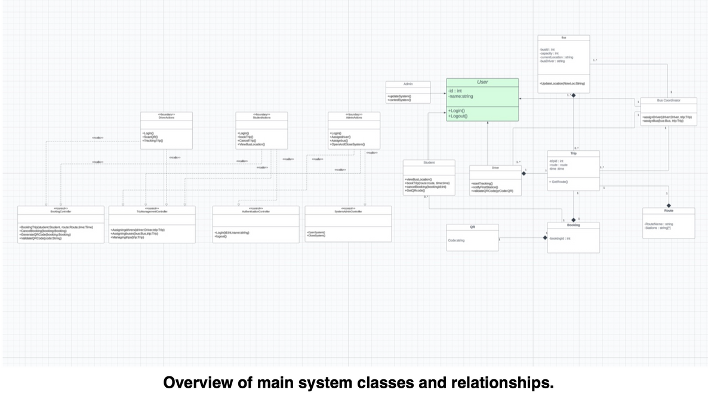

The domain centers on a `User` role hierarchy (`Admin`, `Student`, `Driver`, `Bus Coordinator`), core entities (`Bus`, `Route`, `Trip`, `Booking`, `QR`), and a set of boundary/controller classes (booking, trip management, authentication, and system administration) that mediate between the user roles and the entities.

<strong>Simplified Mermaid reference</strong>

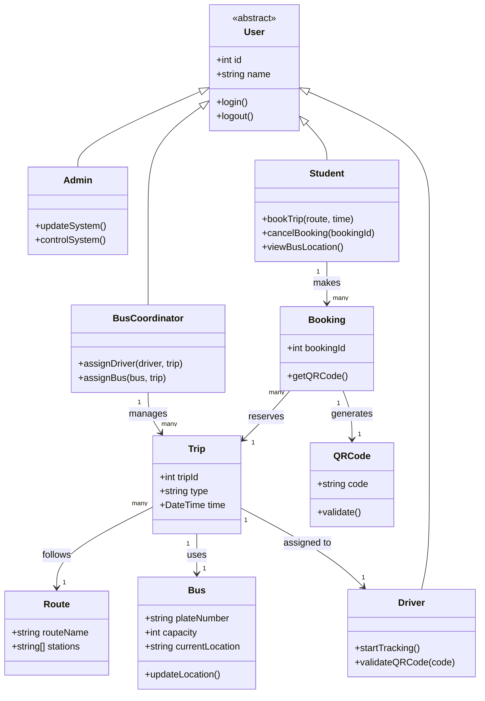
```mermaid
classDiagram
    class User {
        <<abstract>>
        +int id
        +string name
        +login()
        +logout()
    }
    class Admin {
        +updateSystem()
        +controlSystem()
    }
    class Student {
        +bookTrip(route, time)
        +cancelBooking(bookingId)
        +viewBusLocation()
    }
    class Driver {
        +startTracking()
        +validateQRCode(code)
    }
    class BusCoordinator {
        +assignDriver(driver, trip)
        +assignBus(bus, trip)
    }
    class Bus {
        +string plateNumber
        +int capacity
        +string currentLocation
        +updateLocation()
    }
    class Route {
        +string routeName
        +string[] stations
    }
    class Trip {
        +int tripId
        +string type
        +DateTime time
    }
    class Booking {
        +int bookingId
        +getQRCode()
    }
    class QRCode {
        +string code
        +validate()
    }

    User <|-- Admin
    User <|-- Student
    User <|-- Driver
    User <|-- BusCoordinator
    Student "1" --> "many" Booking : makes
    Booking "1" --> "1" QRCode : generates
    Booking "many" --> "1" Trip : reserves
    Trip "many" --> "1" Route : follows
    Trip "1" --> "1" Bus : uses
    Trip "1" --> "1" Driver : assigned to
    BusCoordinator "1" --> "many" Trip : manages
```

---

## 3. Sequence Diagrams (Phase 2)

### 3.1 Booking a Trip — `FR-05`, `FR-08`

  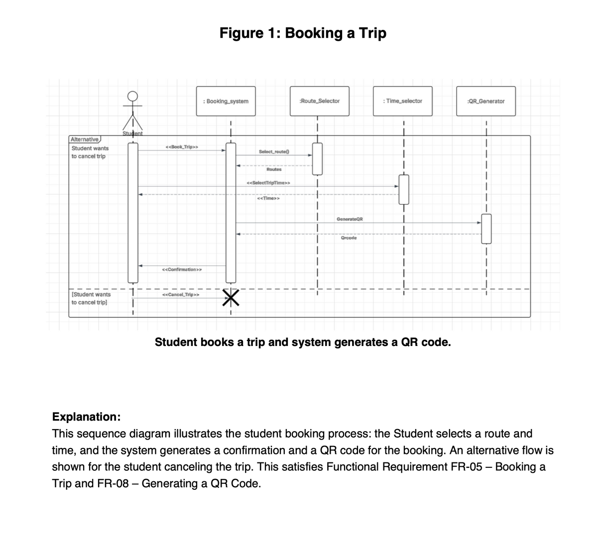

The student selects a route and a time slot; the Booking System coordinates with the Route Selector and Time Selector, then the QR Generator produces a unique code that is returned to the student as confirmation. An alternative flow covers the student cancelling before the booking is finalized.

<strong>Mermaid equivalent</strong>

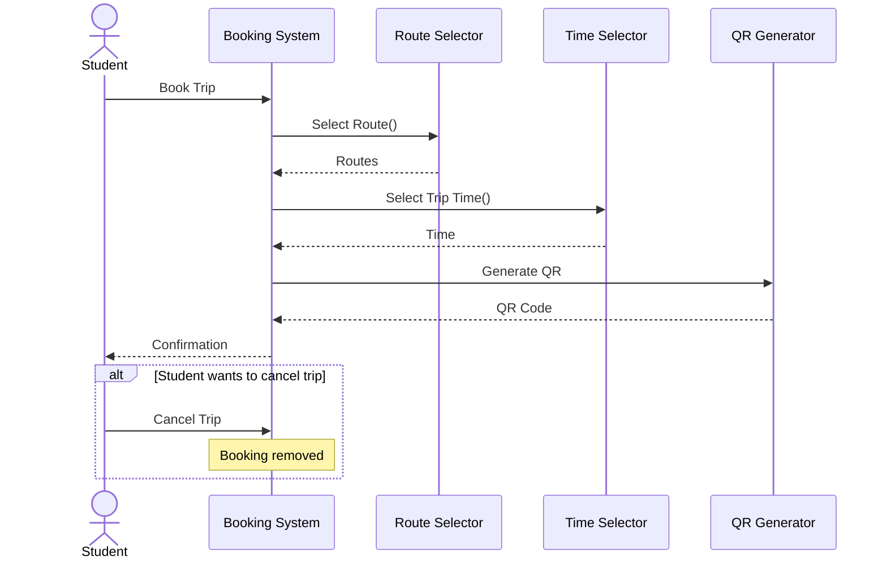
```mermaid
sequenceDiagram
    actor Student
    participant BS as Booking System
    participant RS as Route Selector
    participant TS as Time Selector
    participant QR as QR Generator

    Student->>BS: Book Trip
    BS->>RS: Select Route()
    RS-->>BS: Routes
    BS->>TS: Select Trip Time()
    TS-->>BS: Time
    BS->>QR: Generate QR
    QR-->>BS: QR Code
    BS-->>Student: Confirmation

    alt Student wants to cancel trip
        Student->>BS: Cancel Trip
        Note over BS: Booking removed
    end
```

### 3.2 Real-Time Bus Tracking — `FR-10`, `FR-12`

  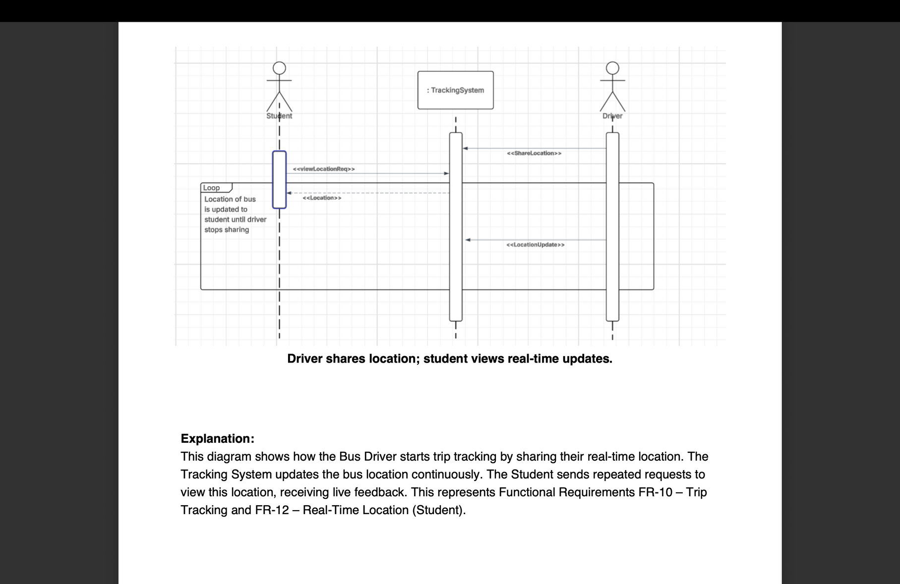

Once the driver starts sharing location, the Tracking System continuously relays live position updates to the student, in a loop that continues until the driver stops sharing.

<strong>Mermaid equivalent</strong>

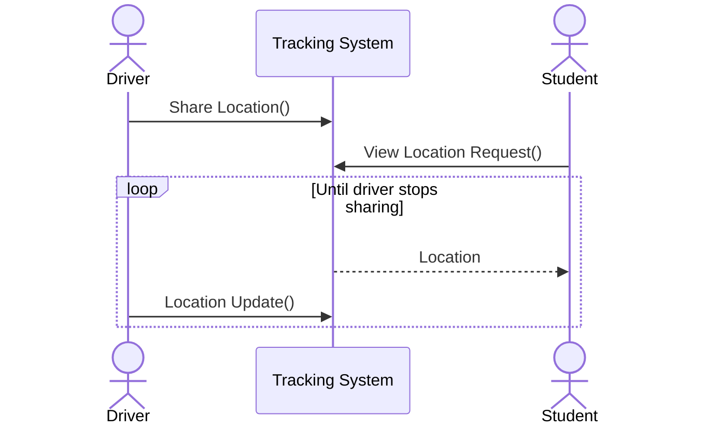
```mermaid
sequenceDiagram
    actor Driver
    participant TS as Tracking System
    actor Student

    Driver->>TS: Share Location()
    Student->>TS: View Location Request()
    loop Until driver stops sharing
        TS-->>Student: Location
        Driver->>TS: Location Update()
    end
```

### 3.3 First Station Notification — `FR-11`

  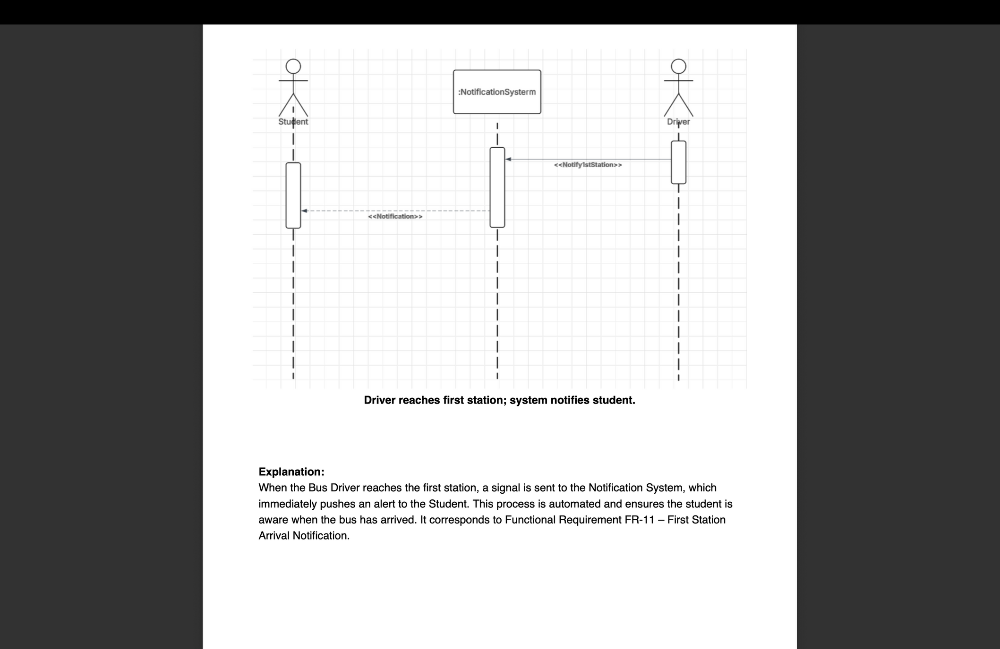

When the driver reaches the first station, a signal is sent to the Notification System, which immediately pushes an alert to the student — an automated step that keeps students informed the moment the trip begins.

### 3.4 QR Code Validation — `FR-13`

  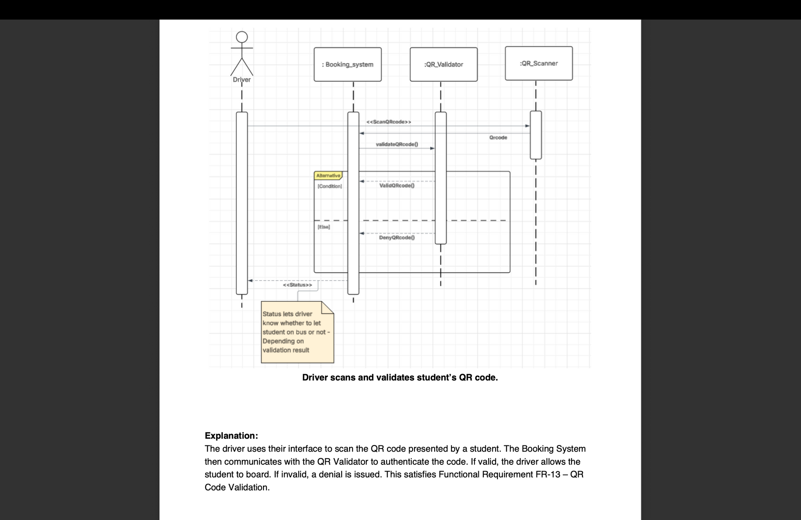

The driver scans a student's QR code through the scanner; the Booking System asks the QR Validator to authenticate it. A valid code authorizes boarding, while an invalid one is denied.

<strong>Mermaid equivalent</strong>

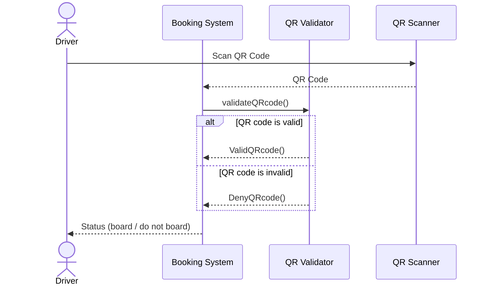
```mermaid
sequenceDiagram
    actor Driver
    participant BS as Booking System
    participant QV as QR Validator
    participant QS as QR Scanner

    Driver->>QS: Scan QR Code
    QS-->>BS: QR Code
    BS->>QV: validateQRcode()
    alt QR code is valid
        QV-->>BS: ValidQRcode()
    else QR code is invalid
        QV-->>BS: DenyQRcode()
    end
    BS-->>Driver: Status (board / do not board)
```

### 3.5 Assigning Drivers and Buses — `FR-01`, `FR-02`

  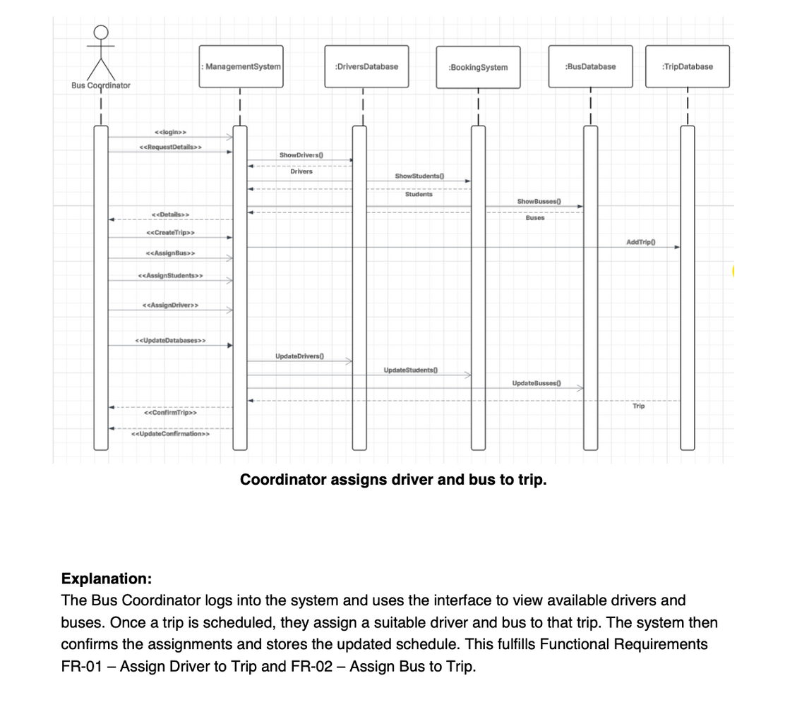

The Bus Coordinator logs in and reviews available drivers and buses. Once a trip is scheduled, the coordinator assigns a suitable driver and bus, and the Management System confirms and stores the updated assignment across the drivers, buses, and trip databases.

### 3.6 System Update — `FR-03`, `FR-04`

  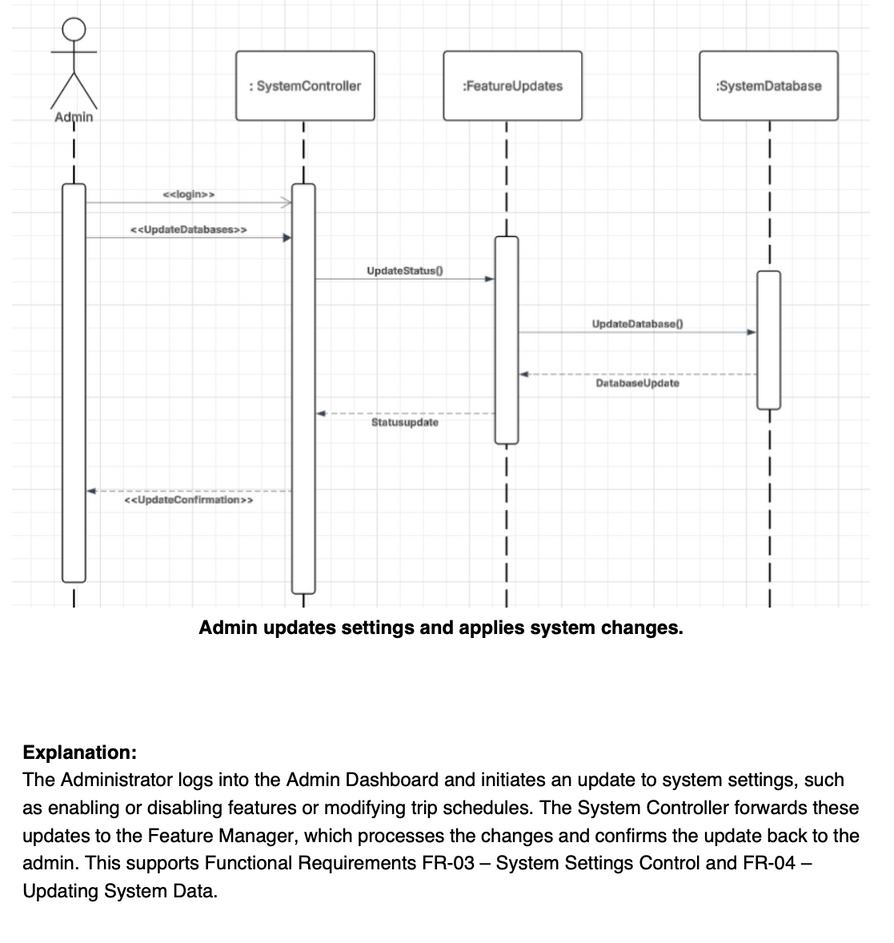

The Administrator logs in and initiates a settings update (enabling/disabling features or modifying trip schedules). The System Controller forwards the change to the feature-update layer, which applies it and confirms back to the administrator.

---

## 4. Activity Diagrams (Phase 3)

### 4.1 Activity Diagram 1 — Student Booking / Cancellation Flow

  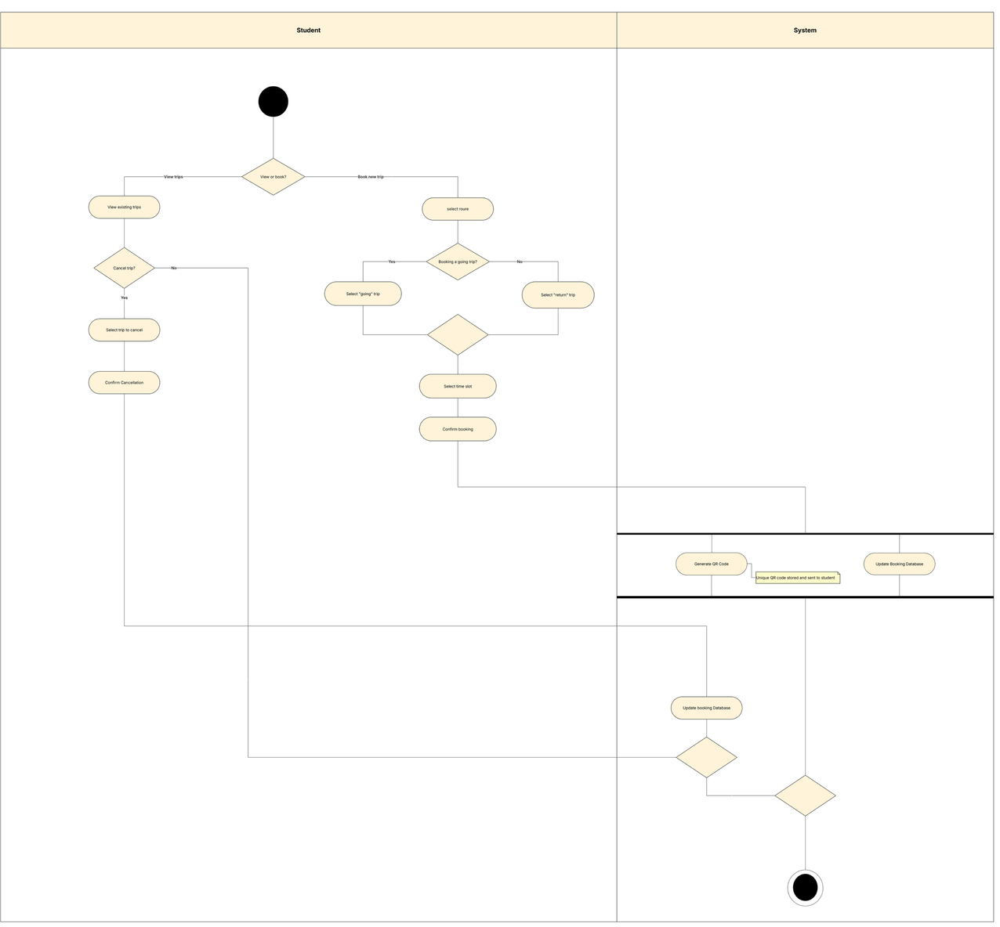

Swimlanes: **Student** and **System**. From a "view or book?" decision, the student either browses existing trips (with the option to cancel one) or books a new trip — selecting a route, choosing "Going" or "Return," picking a time slot, and confirming. On confirmation, the System swimlane generates a unique QR code, stores it, and updates the booking database.

### 4.2 Activity Diagram 2 — Trip Start, Tracking & Boarding Flow

  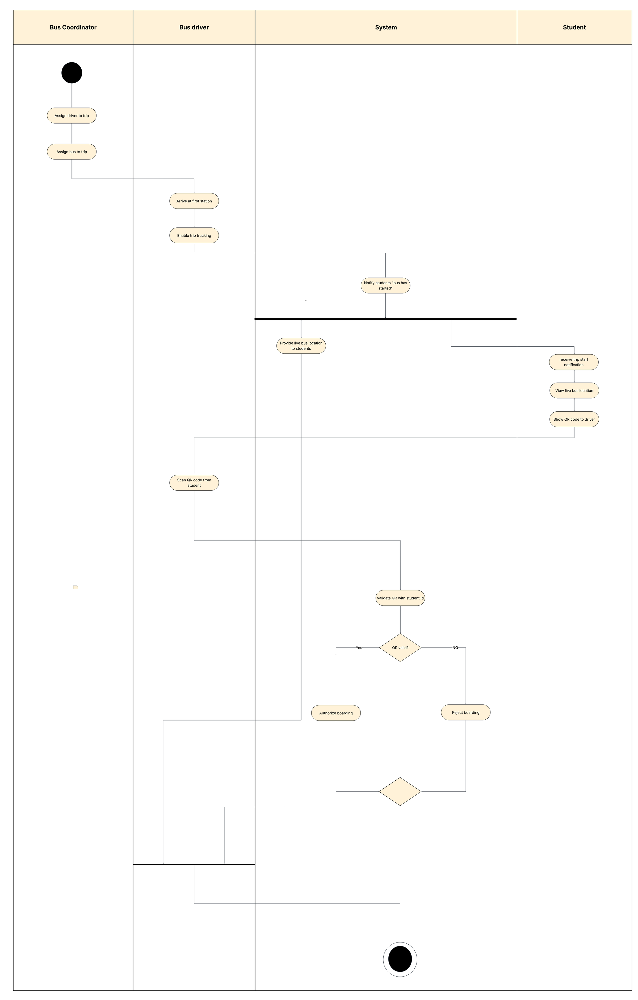

Swimlanes: **Bus Coordinator**, **Bus Driver**, **System**, and **Student**. The coordinator assigns a driver and bus; the driver arrives at the first station and enables tracking; the system notifies students and streams the live location; students view the bus location and present their QR code; the driver scans it, the system validates it against the student's ID, and boarding is authorized or rejected accordingly.

---

## 5. State Diagrams (Phase 3)

### 5.1 State Diagram 1 — Student Booking Lifecycle

  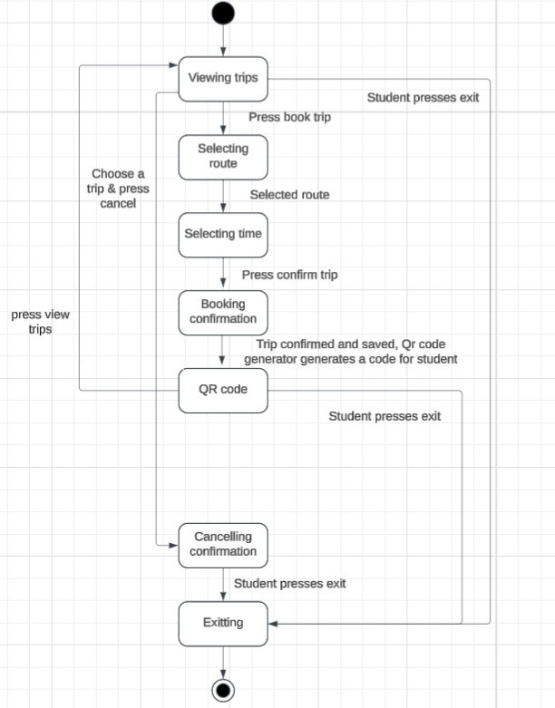

<strong>Mermaid equivalent</strong>

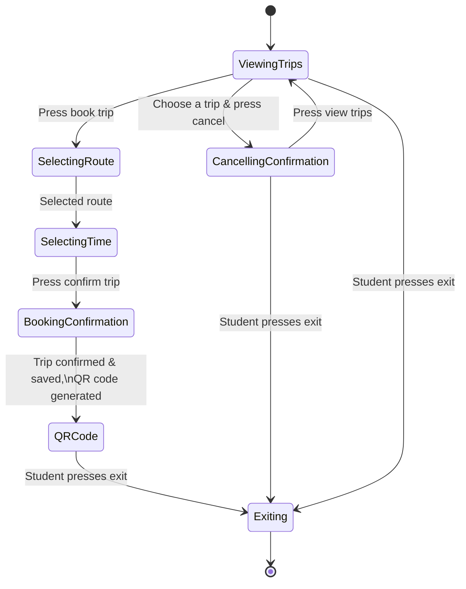
```mermaid
stateDiagram-v2
    [*] --> ViewingTrips
    ViewingTrips --> SelectingRoute: Press book trip
    SelectingRoute --> SelectingTime: Selected route
    SelectingTime --> BookingConfirmation: Press confirm trip
    BookingConfirmation --> QRCode: Trip confirmed & saved,\nQR code generated
    QRCode --> Exiting: Student presses exit
    ViewingTrips --> CancellingConfirmation: Choose a trip & press cancel
    CancellingConfirmation --> ViewingTrips: Press view trips
    CancellingConfirmation --> Exiting: Student presses exit
    ViewingTrips --> Exiting: Student presses exit
    Exiting --> [*]
```

### 5.2 State Diagram 2 — QR Code Validation Lifecycle

  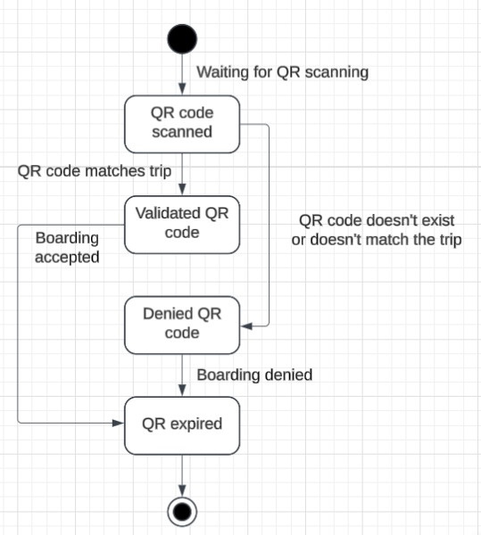

<strong>Mermaid equivalent</strong>

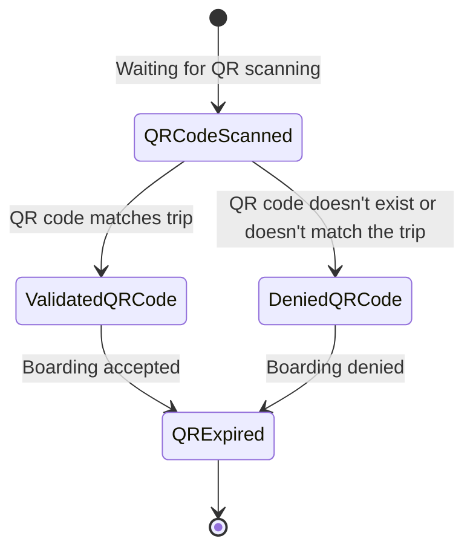
```mermaid
stateDiagram-v2
    [*] --> QRCodeScanned: Waiting for QR scanning
    QRCodeScanned --> ValidatedQRCode: QR code matches trip
    QRCodeScanned --> DeniedQRCode: QR code doesn't exist or doesn't match the trip
    ValidatedQRCode --> QRExpired: Boarding accepted
    DeniedQRCode --> QRExpired: Boarding denied
    QRExpired --> [*]
```

---

## 6. Collaboration Diagrams (Phase 3)

### 6.1 Collaboration Diagram 1 — Real-Time Tracking

  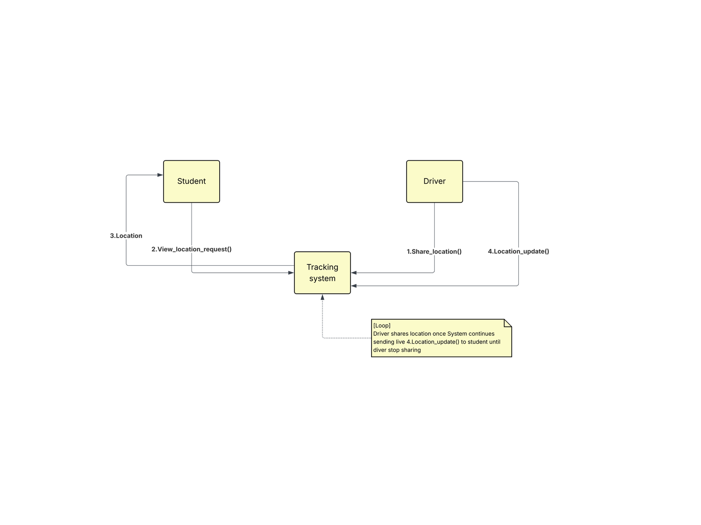

Object interaction view of §3.2: `Driver.Share_location()` → `Tracking system`; `Student.View_location_request()` → `Tracking system` → `Location` back to `Student`; the tracking system continues sending `Location_update()` to the student in a loop until the driver stops sharing.

### 6.2 Collaboration Diagram 2 — Assigning Drivers and Buses

  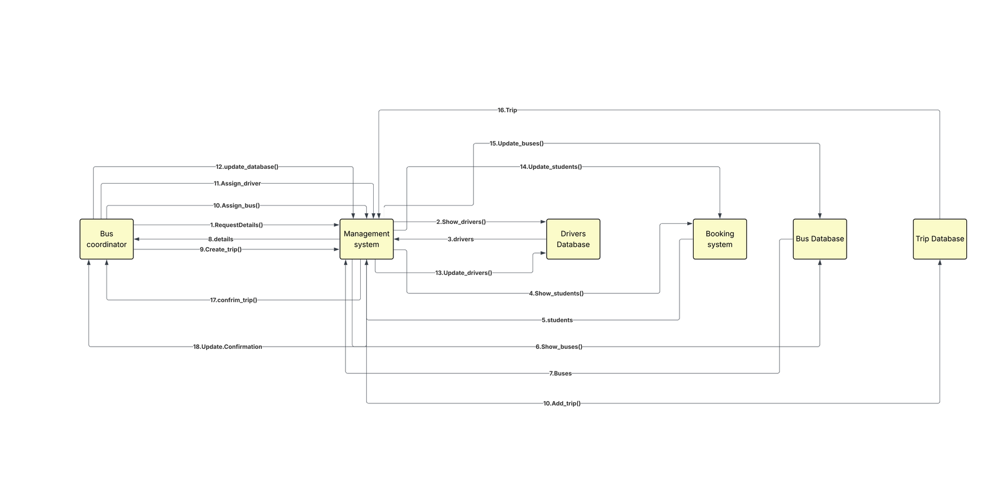

Object interaction view of §3.5: the `Bus Coordinator` requests details from the `Management System`, which pulls driver, student, and bus data from their respective databases, then propagates the coordinator's assignment (driver, bus, trip) back down to the `Trip Database` and returns a confirmation.

### 6.3 Collaboration Diagram 3 — Booking a Trip

  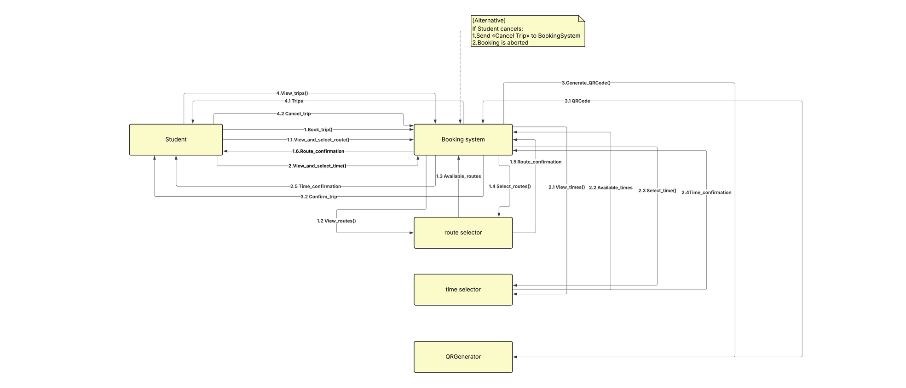

Object interaction view of §3.1: the `Student` interacts with the `Booking System`, which coordinates with the `route selector`, `time selector`, and `QRGenerator` objects to view/select a route and time and generate a QR code. An alternative path shows the student cancelling, which sends a `«Cancel Trip»` message and aborts the booking.

---

## 7. Data Flow Diagrams (Phase 3)

### 7.1 DFD Level 0 — System Context

  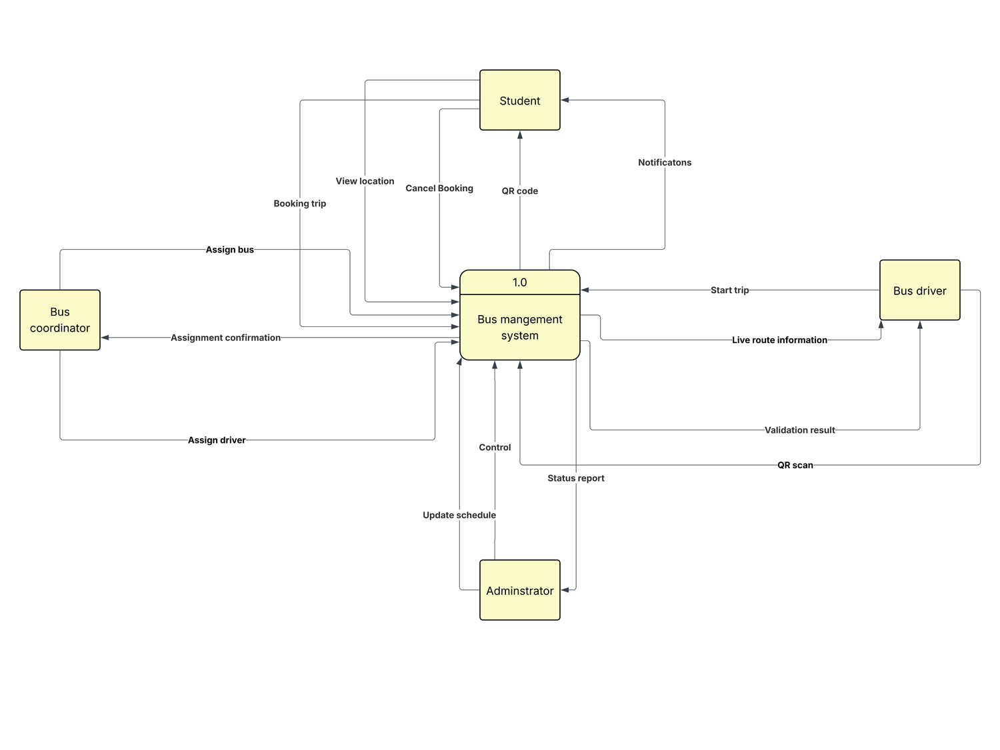

<strong>Mermaid equivalent</strong>

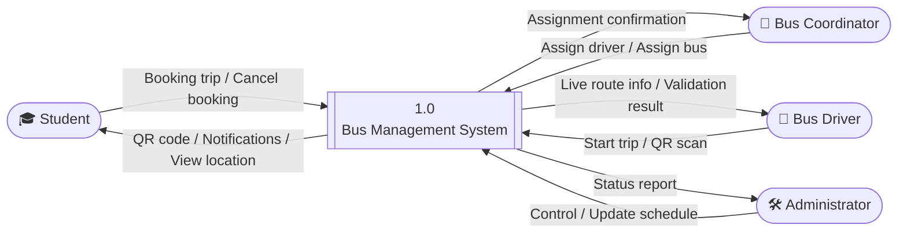
```mermaid
flowchart LR
    Student([🎓 Student])
    Driver([🚌 Bus Driver])
    Coordinator([🧭 Bus Coordinator])
    Admin([🛠️ Administrator])
    System[["1.0\nBus Management System"]]

    Student -- "Booking trip / Cancel booking" --> System
    System -- "QR code / Notifications / View location" --> Student
    Coordinator -- "Assign driver / Assign bus" --> System
    System -- "Assignment confirmation" --> Coordinator
    Driver -- "Start trip / QR scan" --> System
    System -- "Live route info / Validation result" --> Driver
    Admin -- "Control / Update schedule" --> System
    System -- "Status report" --> Admin
```

### 7.2 DFD Level 1 — Process Decomposition

  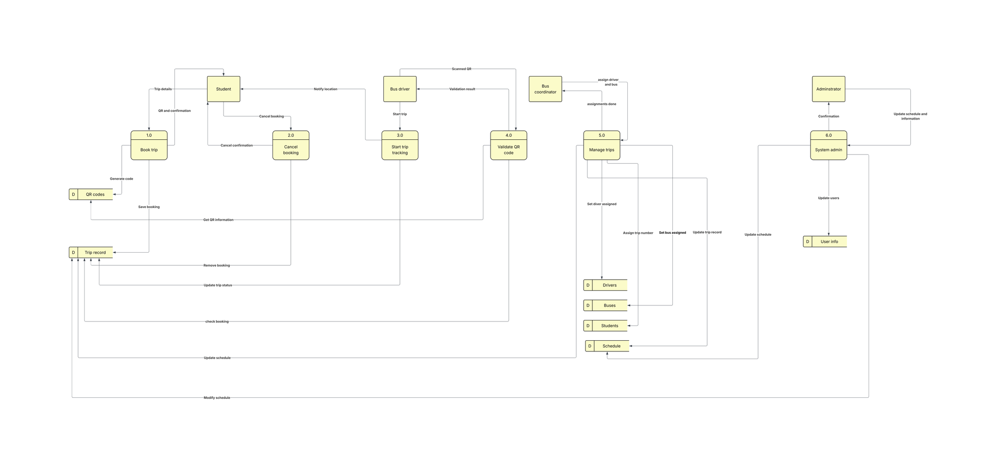

Six processes decompose the single Level-0 process: **1.0 Book Trip**, **2.0 Cancel Booking**, **3.0 Start Trip Tracking**, **4.0 Validate QR Code**, **5.0 Manage Trips**, and **6.0 System Admin** — reading from and writing to seven data stores: QR Codes, Trip Record, Drivers, Buses, Students, Schedule, and User Info.

<strong>Mermaid equivalent</strong>

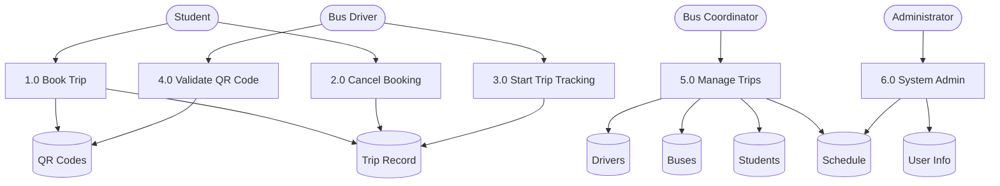
```mermaid
flowchart TB
    Student([Student])
    Driver([Bus Driver])
    Coordinator([Bus Coordinator])
    Admin([Administrator])

    P1["1.0 Book Trip"]
    P2["2.0 Cancel Booking"]
    P3["3.0 Start Trip Tracking"]
    P4["4.0 Validate QR Code"]
    P5["5.0 Manage Trips"]
    P6["6.0 System Admin"]

    D1[("QR Codes")]
    D2[("Trip Record")]
    D3[("Drivers")]
    D4[("Buses")]
    D5[("Students")]
    D6[("Schedule")]
    D7[("User Info")]

    Student --> P1 --> D1 & D2
    Student --> P2 --> D2
    Driver --> P3 --> D2
    Driver --> P4 --> D1
    Coordinator --> P5 --> D3 & D4 & D5 & D6
    Admin --> P6 --> D6 & D7
```

---

> 📎 Back to [`README.md`](README.md) · Requirements in [`REQUIREMENTS.md`](REQUIREMENTS.md) · Use cases in [`USE_CASES.md`](USE_CASES.md)
