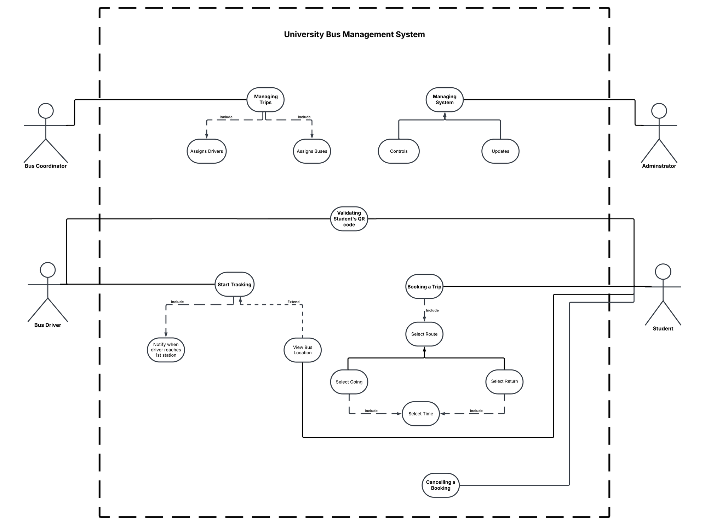

# 🎯 Use Cases & Usage Scenarios
### University Bus Management System

---

## Table of Contents

- [1. Actors](#1-actors)
- [2. Use-Case Diagram](#2-use-case-diagram)
- [3. Use Cases Summary](#3-use-cases-summary)
- [4. Detailed Usage Scenarios](#4-detailed-usage-scenarios)

---

## 1. Actors

| Actor | Description |
|---|---|
| 🎓 **Student** | Books, tracks, and manages personal bus trips; presents a QR code to board. |
| 🚌 **Bus Driver** | Starts live tracking for a trip and validates each student's QR code at boarding. |
| 🧭 **Bus Coordinator** | Assigns drivers and buses to scheduled trips based on demand. |
| 🛠️ **Administrator** | Controls and updates the system, including schedules and user information. |

---

## 2. Use-Case Diagram

  

---

## 3. Use Cases Summary

| # | Use Case | Actor(s) | Description |
|---|---|---|---|
| 1 | **Booking a Trip** | Student | Allows students to book a bus trip by selecting their going and return times, routes, and stations. A QR code is generated for validation before boarding. |
| 2 | **Selecting Route** | Student | The student selects the bus route (e.g., Smouha, Horreya, Corniche, etc.) based on their destination. |
| 3 | **Select Going** | Student | Selected by the student if the trip is a going (outbound) trip. |
| 4 | **Select Return** | Student | Selected by the student if the trip is a return trip. |
| 5 | **Select Time** | Student | Allows the student to select a time slot for the trip, whether "Going" or "Return." |
| 6 | **Cancelling a Booking** | Student | Allows students to cancel a previously booked trip if they no longer need it. |
| 7 | **Starting Tracking** | Bus Driver | The driver initiates the bus tracking feature, allowing students to track the bus in real time. |
| 8 | **Notify When Reaches 1st Station** | Student | The system notifies students when the bus reaches the first station, ensuring they are ready. |
| 9 | **View Bus Location** | Student | Students can track the real-time location of their assigned bus using the system. |
| 10 | **Validating QR Code** | Bus Driver | The driver scans and verifies the student's QR code before allowing them to board the bus. |
| 11 | **Managing Trips** | Bus Coordinator | The bus coordinator assigns drivers and buses to ensure smooth trip scheduling. |
| 12 | **Assigning Drivers** | Bus Coordinator | The coordinator assigns specific drivers to scheduled bus trips. |
| 13 | **Assigning Buses** | Bus Coordinator | The coordinator assigns specific buses to scheduled trips based on availability and capacity. |
| 14 | **Managing System** | Administrator | The administrator oversees system-wide functions, ensuring smooth operations. |
| 15 | **Controlling System** | Administrator | The administrator controls system functions such as opening/closing the system. |
| 16 | **Updating System** | Administrator | The administrator performs system updates, adding new features or modifying configurations. |

---

## 4. Detailed Usage Scenarios

Each scenario below preserves the original structure of the specification: **Description, Actors, Pre-Conditions, Actions, Alternative Actions, Post-Conditions, Includes, Extends, Generalizes.**

<strong>Scenario 01 — Booking a Trip</strong>

| Field | Detail |
|---|---|
| **Description** | Student wants to book a trip. |
| **Actors** | Student |
| **Pre-Conditions** | Student must be logged in. Student must be subscribed to the bus service. |
| **Actions** | The system asks the student to select a route. |
| **Alternative Actions** | — |
| **Post-Conditions** | The student is directed to the "Select a Route" option. |
| **Includes** | Select Route |
| **Extends** | — |
| **Generalizes** | — |

<strong>Scenario 02 — Select a Route</strong>

| Field | Detail |
|---|---|
| **Description** | The student must select one of the available routes. |
| **Actors** | Student |
| **Pre-Conditions** | Student must have initiated a booking by tapping "Booking a Trip." |
| **Actions** | A route is selected for the trip. |
| **Alternative Actions** | — |
| **Post-Conditions** | The route is selected and the student is directed to choose the trip type — "Going" or "Return." |
| **Includes** | — |
| **Extends** | — |
| **Generalizes** | Select Going, Select Return |

<strong>Scenario 03 — Select Going</strong>

| Field | Detail |
|---|---|
| **Description** | The student selects this option if booking an outbound ("Going") trip. |
| **Actors** | Student |
| **Pre-Conditions** | Student must have selected a route. |
| **Actions** | A trip of type "Going" is selected. |
| **Alternative Actions** | — |
| **Post-Conditions** | The student is redirected to choose one of the available time slots for "Going" trips. |
| **Includes** | Select Time |
| **Extends** | — |
| **Generalizes** | Select Route |

<strong>Scenario 04 — Select Return</strong>

| Field | Detail |
|---|---|
| **Description** | The student selects this option if booking a "Return" trip. |
| **Actors** | Student |
| **Pre-Conditions** | Student must have selected a route. |
| **Actions** | A trip of type "Return" is selected. |
| **Alternative Actions** | — |
| **Post-Conditions** | The student is redirected to choose one of the available time slots for "Return" trips. |
| **Includes** | Select Time |
| **Extends** | — |
| **Generalizes** | Select Route |

<strong>Scenario 05 — Select Time</strong>

| Field | Detail |
|---|---|
| **Description** | Student must select a time slot for the trip, whether "Going" or "Return." |
| **Actors** | Student |
| **Pre-Conditions** | Student must have selected a trip type. |
| **Actions** | The pre-chosen trip type is booked for a chosen time slot from those available. |
| **Alternative Actions** | — |
| **Post-Conditions** | The booking process is completed and the student receives a unique QR code for the trip. |
| **Includes** | — |
| **Extends** | — |
| **Generalizes** | — |

<strong>Scenario 06 — Cancelling a Booking</strong>

| Field | Detail |
|---|---|
| **Description** | Student can cancel a trip. |
| **Actors** | Student |
| **Pre-Conditions** | There must be a booked trip. Cancellation must occur **at most 30 minutes before** the trip. |
| **Actions** | The student selects the pre-booked trip they want to cancel. |
| **Alternative Actions** | — |
| **Post-Conditions** | The trip is cancelled and removed from the system. |
| **Includes** | — |
| **Extends** | — |
| **Generalizes** | — |

<strong>Scenario 07 — Start Tracking</strong>

| Field | Detail |
|---|---|
| **Description** | The driver enables the tracking feature once reaching the first station during a "Going" trip. |
| **Actors** | Driver |
| **Pre-Conditions** | Driver must be logged into the system. Driver must be assigned to this trip. |
| **Actions** | Bus tracking is enabled for the students booked on this trip. |
| **Alternative Actions** | — |
| **Post-Conditions** | Live-location tracking becomes available. "View Bus Location" is now enabled for the student. |
| **Includes** | Notify When Reaches 1st Station |
| **Extends** | View Bus Location |
| **Generalizes** | — |

<strong>Scenario 08 — Notify When Reaches 1st Station</strong>

| Field | Detail |
|---|---|
| **Description** | The system notifies the student that the trip has begun once the driver enables tracking upon reaching the first station. |
| **Actors** | Student |
| **Pre-Conditions** | Student must have booked this trip. |
| **Actions** | A notification is sent to the student: *"The bus has reached the 1st Station."* |
| **Alternative Actions** | — |
| **Post-Conditions** | — |
| **Includes** | — |
| **Extends** | — |
| **Generalizes** | — |

<strong>Scenario 09 — View Bus Location</strong>

| Field | Detail |
|---|---|
| **Description** | The student can view the live bus location for a booked "Going" trip. |
| **Actors** | Student |
| **Pre-Conditions** | Student must have booked this trip. |
| **Actions** | The live bus location is shown to the student. |
| **Alternative Actions** | — |
| **Post-Conditions** | The student is able to see the live bus location. |
| **Includes** | — |
| **Extends** | — |
| **Generalizes** | — |

<strong>Scenario 10 — Validating Student's QR Code</strong>

| Field | Detail |
|---|---|
| **Description** | The driver validates the student's identity and booking by scanning the student's trip QR code. |
| **Actors** | Driver, Student |
| **Pre-Conditions** | Student must have completed a trip booking and received a unique QR code for it. |
| **Actions** | Driver scans the QR code. The student's identity appears for the driver to check. The student's booking details are reviewed by the driver. |
| **Alternative Actions** | — |
| **Post-Conditions** | The student can now ride the bus after driver verification. |
| **Includes** | — |
| **Extends** | — |
| **Generalizes** | — |

<strong>Scenario 11 — Managing Trips</strong>

| Field | Detail |
|---|---|
| **Description** | The bus coordinator is responsible for trip management by assigning and distributing buses and drivers based on the students' ratio for each route and time slot. |
| **Actors** | Bus Coordinator |
| **Pre-Conditions** | Bus Coordinator must be logged in. Trips must have been booked by students. Booking must be closed (30 minutes before return trips, 3 hours before going trips). |
| **Actions** | The bus coordinator is redirected to assign bus(es) and driver(s) for each route and time slot according to the students' count. |
| **Alternative Actions** | — |
| **Post-Conditions** | Drivers and buses are assigned for each route. |
| **Includes** | Assigning Drivers, Assigning Buses |
| **Extends** | — |
| **Generalizes** | — |

<strong>Scenario 12 — Assigning Drivers</strong>

| Field | Detail |
|---|---|
| **Description** | The bus coordinator assigns drivers for each route. |
| **Actors** | Bus Coordinator |
| **Pre-Conditions** | Trips must have been booked by students. Booking must be closed (30 minutes before return trips, 3 hours before going trips). |
| **Actions** | The coordinator assigns a driver's name to each route for a given time. |
| **Alternative Actions** | — |
| **Post-Conditions** | Drivers are assigned for each route. |
| **Includes** | — |
| **Extends** | — |
| **Generalizes** | — |

<strong>Scenario 13 — Assigning Buses</strong>

| Field | Detail |
|---|---|
| **Description** | The bus coordinator assigns buses for each route. |
| **Actors** | Bus Coordinator |
| **Pre-Conditions** | Trips must have been booked by students. Booking must be closed (30 minutes before return trips, 3 hours before going trips). |
| **Actions** | The coordinator assigns a bus's plate number to each route for a given time. |
| **Alternative Actions** | — |
| **Post-Conditions** | Buses are assigned for each route. |
| **Includes** | — |
| **Extends** | — |
| **Generalizes** | — |

<strong>Scenario 14 — Managing System</strong>

| Field | Detail |
|---|---|
| **Description** | Managing the system as a whole. |
| **Actors** | Administrator |
| **Pre-Conditions** | — |
| **Actions** | The administrator can control (open/close) the system and update (add/remove/edit) features. |
| **Alternative Actions** | — |
| **Post-Conditions** | The system is under the administrator's control and can be updated. |
| **Includes** | — |
| **Extends** | — |
| **Generalizes** | Controls, Updates |

<strong>Scenario 15 — Controls</strong>

| Field | Detail |
|---|---|
| **Description** | Controlling the system. |
| **Actors** | Administrator |
| **Pre-Conditions** | — |
| **Actions** | The administrator can control (open/close) the system and monitor it. |
| **Alternative Actions** | — |
| **Post-Conditions** | The system is under the administrator's control. |
| **Includes** | — |
| **Extends** | — |
| **Generalizes** | Managing System |

<strong>Scenario 16 — Updates</strong>

| Field | Detail |
|---|---|
| **Description** | Updating the system. |
| **Actors** | Administrator |
| **Pre-Conditions** | — |
| **Actions** | The administrator can update the system, such as adding, removing, or editing features. |
| **Alternative Actions** | — |
| **Post-Conditions** | The system is updated by the administrator. |
| **Includes** | — |
| **Extends** | — |
| **Generalizes** | Managing System |

---

> 📎 See [`REQUIREMENTS.md`](REQUIREMENTS.md) for the functional/non-functional requirements each of these scenarios satisfies, and [`SYSTEM_DESIGN.md`](SYSTEM_DESIGN.md) for the sequence, state, activity, collaboration, and data-flow diagrams that model them.
